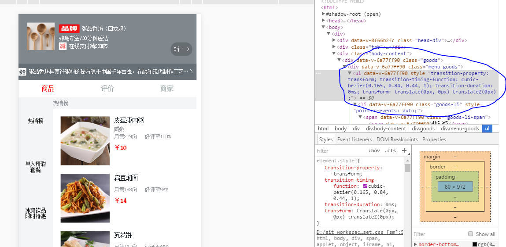

# vue_seller

> A Vue.js project

## Build Setup

``` bash
# install dependencies
npm install

# serve with hot reload at localhost:8080
npm run dev

# build for production with minification
npm run build

# build for production and view the bundle analyzer report
npm run build --report
```

For a detailed explanation on how things work, check out the [guide](http://vuejs-templates.github.io/webpack/) and [docs for vue-loader](http://vuejs.github.io/vue-loader).
## 安装better-scroll  
注意npm的命令执行，之前就是不记得npm i better-scroll -S  
## better-scroll使用  
在html标签中设置需要使用的标签。  
```html
<div class="menu-goods" ref="menuWrapper">
      <ul>
        <li v-for="good in goods" class="goods-li">
          <span class="goods-li-span">
            <span>{{good.name}}</span>
          </span>
        </li>
      </ul>
    </div>
```
这里调用this.menuScroll=new BScroll(this.$refs.menuWrapper,{});初始化后就会可以滚动了。  

Vue.js 提供了我们一个获取 DOM 对象的接口—— vm.$refs。
```js
this.menuScroll=new BScroll(this.$refs.menuWrapper,{});
```
